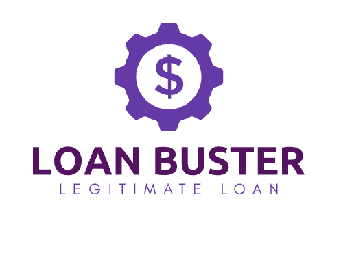

[![LinkedIn][linkedin-shield]][linkedin-url]

<div align="center">

</div>

# Loan Repayment Prediction

Predict whether a customer will repay their loan or not based on their financial data. It uses machine learning algorithms to analyze customer data and predict the likelihood of loan repayment.

## Getting Started

These instructions will get you a copy of the project up and running on your local machine for development and testing purposes.

### Prerequisites

- Python 3.x
- Jupyter Notebook

### Installation

Clone the repository to your local machine:
```sh
git clone https://github.com/SarCode/Loan-Repayment-Prediction.git
```

## Usage

1. Open `Loan Repayment Prediction.ipynb` in Jupyter Notebook.
2. Follow the steps outlined in the notebook to load and preprocess the data.
3. Train the machine learning models on the preprocessed data.
4. Evaluate the performance of the models using various metrics.
5. Use the trained models to predict whether a customer will repay their loan or not.

## Contributing

If you'd like to contribute to this project, please follow these guidelines:

1. Fork the repository.
2. Create a new branch for your feature or bug fix.
3. Make your changes and commit them with clear commit messages.
4. Push your changes to your fork.
5. Submit a pull request.


## Acknowledgments

- The data used in this project is from the LendingClub dataset on Kaggle: https://www.kaggle.com/wendykan/lending-club-loan-data
- Inspiration for this project came from the Udacity Machine Learning Engineer Nanodegree program.


[linkedin-shield]: https://img.shields.io/badge/-LinkedIn-black.svg?style=for-the-badge&logo=linkedin&colorB=555
[linkedin-url]: https://www.linkedin.com/in/sarthak-agarwal-dell/
